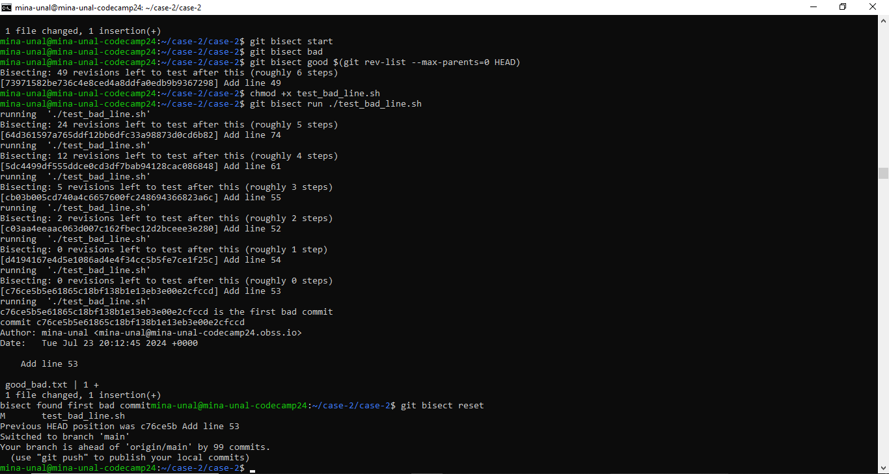

1) case2.sh dosyası çalıştırılır. Bu script, good_bad.txt adında bir dosya oluşturarak rastgele 100 satırdan birine "bad" ekler. Oluşturduğu her satır için ayrı bir commit işlemi yapar. 
2) daha sonra screenshotlarda gösterildiği gibi bisect işlemi başlatılır. Mevcut commit bad, ilk commit good olarak ayarlanır. Daha sonra bisect için test_bad_line.sh scripti çalıştırılarak içinde "bad" geçen satırı bulunca aramayı sonlandırır.

